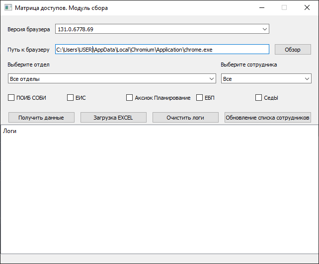
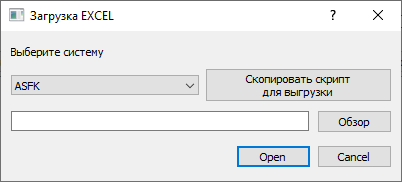

# Модуль сбора полномочий (Authorization Matrix Collector)

## 🚀 Обзор проекта

**Authorization Matrix Collector** — это инструмент для автоматизированного сбора и систематизации полномочий пользователей из различных корпоративных систем. Проект представляет собой универсальную платформу, которая объединяет множество методов получения данных в едином интерфейсе.

Данная программа связана с другими проектами:

-   [UFK_project-server](https://github.com/Ara-Bog/UFK_project-server)
-   [UFK_project-frontend](https://github.com/Ara-Bog/UFK_project-frontend)

### 🌟 Ключевые возможности

-   **Мультисистемная поддержка**: Работа с ПОИБ СОБИ, ЕИС, Аксиок Планирование, ЕБП, СЕД, АСФК, СУФД
-   **Гибкие методы сбора**: Скрейпинг, API-запросы, работа с БД, загрузка файлов
-   **Интуитивный GUI**: Современный интерфейс на PyQt5
-   **Пакетная обработка**: Одновременная работа с сотнями пользователей
-   **Расширяемая архитектура**: Легкое добавление новых систем и методов

## 🏗️ Архитектура решения

### Основные компоненты

```
📦 AuthorizationMatrixCollector
├── 🎨 main.py              # Основной GUI и логика приложения
├── ⚙️ build.bat            # Скрипт сборки для Windows
├── 🔧 handler.py           # Обработчики для различных систем
├── 📊 interfaces/          # Файлы интерфейсов Qt Designer
├── 🔐 passwords.py         # Конфигурация подключений
└── 🚀 drivers/             # WebDriver для браузерной автоматизации
```

### Поддерживаемые методы сбора

| Метод                | Системы           | Особенности                  |
| -------------------- | ----------------- | ---------------------------- |
| **Web Scraping**     | ЕИС               | Автоматизация через Selenium |
| **API Integration**  | СОБИ, ЕБП, Аксиок | Прямые HTTP-запросы          |
| **Database Queries** | СедЫ              | Прямое подключение к БД      |
| **File Processing**  | Excel-файлы       | Загрузка excel файлов        |

## 🛠️ Сборка проекта

### Автоматическая сборка (Windows)

Для создания исполняемого файла используйте скрипт `build.bat`:

```bash
# Запуск сборки
build.bat
```

**Что делает скрипт сборки:**

-   Очищает предыдущие сборки
-   Активирует виртуальное окружение
-   Собирает приложение в один исполняемый файл
-   Включает необходимые ресурсы (интерфейсы, драйверы)
-   Добавляет иконку приложения

### Ручная сборка

```bash
# Установка зависимостей
pip install -r requirements.txt

# Сборка через PyInstaller
pyinstaller --onefile --add-data="interfaces;interfaces" --add-data="drivers;drivers" --icon="icon.ico" --name=matrix main.py
```

### Параметры сборки

| Параметр      | Назначение                            |
| ------------- | ------------------------------------- |
| `--onefile`   | Собрать в один исполняемый файл       |
| `--add-data`  | Включить дополнительные файлы         |
| `--icon`      | Установить иконку приложения          |
| `--noconsole` | Скрыть консоль (для финальной версии) |

## 🖥️ Интерфейс пользователя

### Основное окно приложения



-   **Выбор подразделений**: Селектовый выбор отделов
-   **Выбор пользователей**: Селектовый выбор сотрудников
-   **Настройка систем**: Чекбоксы для выбора целевых систем
-   **Панель логов**: Реальное время отслеживания процесса

### Диалоговые окна



-   **Загрузчик Excel**: Интеллектуальная обработка файлов с прогресс-баром

## 🔧 Технические особенности

### Многопоточная обработка

```python
# Пример многопоточной архитектуры
t1 = threading.Thread(target=self.process_logs, args=(list_systems,))
t1.start()
```

### Универсальная система логгирования

```python
MESSAGES = {
    100: {'type_msg': 'info', 'title': "Сбор данных в системе - {} закончен."},
    201: {'type_msg': 'success', 'title': "Данные добавлены в базу данных!"},
    404: {'type_msg': 'warn', 'title': "Пользователь {} не найден в подсистеме."}
}
```

### Поддержка различных версий браузеров

```python
__chrome_versions = {
    '131.0.6778.69': 'drivers/chromedriver_131.exe',
    '109.0.5414.173': 'drivers/chromedriver_109.exe'
}
```

## 📊 Форматы выходных данных

### Структура хранения полномочий

```python
{
    'система': {
        'parent': 'родительская система',
        'roles': {
            'роль': ['пользователь1', 'пользователь2']
        }
    }
}
```

### База данных матрицы полномочий

-   **matrix_systems**: Каталог информационных систем
-   **matrix_roles**: Справочник ролей и полномочий
-   **matrix_userroles**: Связи пользователей с ролями
-   **matrix_logupdates**: История обновлений

## 🚀 Быстрый старт

### Основные требования

-   Python 3.8+
-   PostgreSQL/другая СУБД
-   Chrome/Chromium браузер
-   Доступ к корпоративным системам

1. **Создание виртуального окружения:**

```bash
python -m venv env
```

2. **Активация окружения:**

```bash
# Windows
env\Scripts\activate

# Linux
source env/bin/activate
```

3. **Установка зависимостей:**

```bash
pip install -r requirements.txt
```

### Разработческий режим

```bash
python main.py
```

### Продакшен-режим

```bash
# После сборки
dist/matrix.exe
```

## 🔒 Безопасность и настройки

### Конфигурация подключений

```python
# passwords.py пример структуры
# подключения к аксиок, для выполнения запросов
AXIOK = {
    'auth': {
        'login': 'username',
        'password': 'secure_password',
    },
    'server': 'http://aksiok/'
}
# подключение к бд, куда вносятся данные
DB = {
    'user': 'username',
    'password': 'secure_password',
    'host': 'localhost',
    'port': 5432,
}
# подключение к седу
SED_CONNECT = {
    'user': 'username',
    'password': 'secure_password',
}
# адреса баз седа
SED_DB = {
    '0.0.0.0': 'SED1K',
    '0.0.0.0': 'SED2K',
    '0.0.0.0': 'SED3K',
}
# синхронизация пользователей с AD
API_LDAP = 'http://localhost:8000/api/end_point'
# Для предоставления скрипта внутри программы
SCRIPTS = {
    'ASFK': '''
SELECT *
FROM table_name
''',
    'SUFD': '''
SELECT *
FROM table_name
''',
    'SED1K': '''
SELECT *
FROM table_name
''',
    'SED2K': '''
SELECT *
FROM table_name
''',
    'SED3K': '''
SELECT *
FROM table_name
''',
    'CKS': '''
SELECT *
FROM table_name
'''
}
```

## 📈 Мониторинг и отчетность

### Статистика обработки

-   Количество обработанных пользователей
-   Детализация по системам
-   Отслеживание ошибок и предупреждений

### Журналирование операций

```python
# Пример записи в лог
self.addLogs(201, [], f'Обработано: {count} записей')
```

## 🔄 Интеграционные возможности

### REST API синхронизация

```python
def sync_ldap_users(self):
    response = requests.post(passwords.API_LDAP)
    # Автоматическое обновление пользовательской базы
```

## 🛠️ Расширение функциональности

### Добавление новой системы

1. Реализовать метод в `handler.py`
2. Добавить конфигурацию в `__routes`
3. Обновить `SYSTEMS` в `main.py`

---
** Разработано для УФК по Московской области **

**💡 Примечание:** Данное решение предназначено для использования в корпоративной среде и требует соответствующей настройки параметров безопасности и подключения к внутренним системам.
